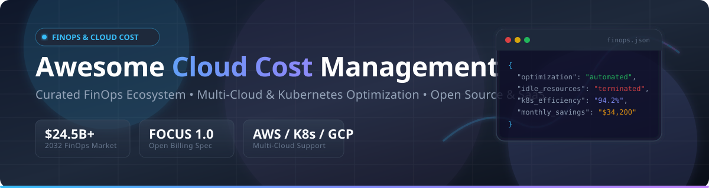

# Awesome Cloud Cost Management ☁️💰

A curated directory of top **Cloud Cost Management (FinOps) platforms**, open-source tools, Kubernetes cost allocation engines, multi-cloud cost visibility dashboards, shift-left Terraform cost estimation CLI tools, and automated cloud optimization solutions.

---

## 💡 Market Landscape & Sector Analysis

> [!NOTE]
> **Market Size & Forecast**: The global Cloud Cost Management and FinOps Software Market is valued at **$10.8 Billion in 2026** and is projected to expand to **$24.5 Billion by 2032** (CAGR of ~14.8%), driven by massive enterprise multi-cloud spend, AI infrastructure workloads, and Kubernetes deployment scale.
> 
> **Market Fragmentation**: The sector is **highly fragmented**. Rather than a single "winner-take-all" platform, the landscape is divided across hyperscaler-native tools (AWS Cost Explorer, Azure Cost Management), enterprise billing suites (Apptio/IBM, Flexera, Broadcom CloudHealth), autonomous rate & commitment optimizers (ProsperOps, Zesty), and specialized Kubernetes / developer-centric solutions (Kubecost, Cast AI, Infracost).

---

## 📋 Table of Contents

- [🏢 SaaS & Hosted Platforms](#-saas--hosted-platforms)
- [🔓 Open-Source GitHub Projects](#-open-source-github-projects)
- [🛠️ Additional Open-Source Options & Frameworks](#️-additional-open-source-options--frameworks)
- [🤝 How to Contribute](#-how-to-contribute)
- [💖 Support & Community](#-support--community)
- [⚠️ Disclaimer](#%EF%B8%8F-disclaimer)
- [📈 Star History](#-star-history)

---

## 🏢 SaaS & Hosted Platforms

Below is a curated comparison of major commercial FinOps and Cloud Cost Management SaaS platforms, sorted by **Company Size / Valuation / Funding** (descending).

| Product 🚀 | Description 📝 | Company Scale / Valuation / Funding 💰 | Starting Price 💵 | Free Tier / Free Trial Limit 🎁 |
| :--- | :--- | :--- | :--- | :--- |
| **[IBM Turbonomic](https://www.ibm.com/products/turbonomic)** | Application resource management platform assuring performance while optimizing cost across hybrid clouds. | **$160B+ Market Cap** (Part of IBM; Turbo acq. for $1.5B) | Custom tier based on Managed Virtual Servers (e.g. ~$37,900/yr for 200 MVS) | 30-day free trial via AWS Marketplace |
| **[Apptio Cloudability](https://www.apptio.com/products/cloudability/)** | Enterprise FinOps platform for multi-cloud cost allocation, anomaly detection, and commitment management. | **$4.6B Acquisition** (Acquired by IBM in 2023) | ~$2,500/month (billed annually for spend up to $1M/yr) | 14-day free trial upon request |
| **[CloudHealth by VMware](https://www.vmware.com/products/cloudhealth.html)** | Enterprise multi-cloud cost management, governance, security, and policy enforcement platform. | **$61B Acquisition** (Part of VMware / Broadcom) | Tiered based on monthly cloud spend (~2.2% - 3.0% of managed spend) | 14-day free trial upon request |
| **[Flexera One](https://www.flexera.com/)** | Hybrid IT asset and cloud cost management platform providing cost visibility, optimization, and governance. | **$3B+ Enterprise Valuation** (Thoma Bravo backed) | Custom enterprise quotes based on managed node/server count | 14-day free trial (via Spot by Flexera listing) |
| **[Spot by NetApp](https://spot.io/)** | Cloud infrastructure optimization platform for automated cluster scaling, bin-packing, and spot management. | **$15B+ NetApp Market Cap** (Divested/Partnered with Flexera) | Usage-based per vCPU-hour managed | 14-day free trial & Free tier up to 20 virtual machines |
| **[Kubecost](https://www.kubecost.com/)** | Commercial Kubernetes cost management platform built on OpenCost engine with multi-cluster aggregation. | **Acquired by IBM (2024)** (Prior funding: $67M+) | Business plan starting at $449/month | Free Foundations edition for unlimited clusters up to 250 cores (15-day retention) |
| **[Cast AI](https://cast.ai/)** | Autonomous Kubernetes cost optimization platform. Rightsizes pods, selects instance types, manages spot instances. | **$73M Total Funding** ($35M Series B in 2023) | Growth Plan starting at base tier + $0.00694 per CPU/hour managed | Free Forever Kubernetes Cost Monitoring tier (unlimited clusters) |
| **[CloudZero](https://www.cloudzero.com/)** | Cloud cost intelligence platform focused on unit economics, hourly granularity, and multi-cloud & SaaS spend tracking. | **$118M Total Funding** ($56M Series C in May 2025) | $19.00/unit/month ($1k AWS spend unit; ~1.9% of spend) | Free trial via AWS Marketplace & free Cloud Cost Assessment tool |
| **[Finout](https://www.finout.io/)** | FinOps platform with MegaBill technology that unifies billing data from cloud providers and SaaS tools. | **$45M Total Funding** ($26.3M Series B in 2024) | Tiered annual subscription based on committed cloud spend | 14-day free trial (all features) |
| **[Zesty](https://zesty.co/)** | Automated cloud cost optimization platform for dynamic commitment management (RIs/Savings Plans) and disk scaling. | **$42M Total Funding** ($75M valuation estimate) | Success-based pricing (% of realized savings) or spend tier | Free Potential Savings Analysis report |
| **[ProsperOps](https://www.prosperops.com/)** | Automated commitment management platform optimizing Reserved Instances and Savings Plans. | **$33M Total Funding** (H.I.G. Growth Growth round) | Performance-based Savings Share fee (% of realized savings) | Free Savings Analysis & trial assessment |
| **[Vantage](https://www.vantage.sh/)** | Cloud cost transparency platform with flat annual fees, Kubernetes cost reporting, and virtual tagging. | **$25M Total Funding** ($21M Series A led by Scale Venture Partners) | Pro plan starting at $300/month | Free Forever Starter plan up to $2,500 tracked monthly cloud spend |
| **[nOps](https://www.nops.io/)** | AWS cost optimization platform with container visibility, automated tagging, and commitment management. | **$15M+ Total Funding** (AWS Advanced Tech Partner) | Fixed fee for visibility + performance share on rate optimization savings | 14-day free trial & free 30-minute savings analysis |
| **[Densify](https://www.densify.com/)** | Cloud resource optimization using machine learning for rightsizing and workload placement (Kubex). | **$60M+ Total Funding** (Private Equity backed) | Custom enterprise quote based on managed infrastructure scope | 14-day free trial |

---

## 🔓 Open-Source GitHub Projects

Sorted by **GitHub_Stars** (descending). Each repository name includes a white social Stars_Badge linking directly to its GitHub stargazers page.

| Project 🛠️ | GitHub_Stars ⭐ | Description 📝 | License 📜 |
| :--- | :--- | :--- | :--- |
| **[Apache Superset](https://github.com/apache/superset)** |  | Modern data exploration and visualization platform. Widely used for building custom enterprise FinOps dashboards on FOCUS-formatted billing data. | Apache-2.0 |
| **[Infracost](https://github.com/infracost/infracost)** |  | Shift-left cloud cost estimates for Terraform, Terragrunt, CloudFormation, and AWS CDK directly in Pull Requests and IDEs. | Apache-2.0 |
| **[Steampipe](https://github.com/turbot/steampipe)** |  | Zero-ETL engine to query cloud APIs (AWS, Azure, GCP, K8s) using SQL to find idle resources and spend anomalies. | AGPL-3.0 |
| **[Cloud Custodian](https://github.com/cloud-custodian/cloud-custodian)** |  | CNCF Incubating rules engine for cloud governance, off-hours scheduling, tag enforcement, and automated garbage collection. | Apache-2.0 |
| **[OpenCost](https://github.com/opencost/opencost)** |  | CNCF Incubating real-time Kubernetes cost allocation engine broke down by namespace, pod, service, and cloud provider. | Apache-2.0 |
| **[Komiser](https://github.com/tailwarden/komiser)** |  | Open-source cloud environment inspector and multi-cloud asset inventory dashboard for surfacing hidden cost drivers. | Apache-2.0 |
| **[StackQL](https://github.com/stackql/stackql)** |  | SQL-based framework to query and deploy cloud infrastructure and analyze cost utilization. | MIT |
| **[Kubecost Helm Chart](https://github.com/kubecost/cost-analyzer-helm-chart)** |  | Open-source deployment chart for Kubecost's free tier, bringing cost insights and cluster rightsizing. | Apache-2.0 |
| **[FOCUS Specification](https://github.com/finopsfoundation/focus)** |  | FinOps Open Cost and Usage Specification — open specification for standardizing cloud billing data across vendors. | CC-BY-4.0 |
| **[Awesome FinOps](https://github.com/jmfontaine/awesome-finops)** |  | Curated community list of FinOps resources, books, courses, standards, and cloud cost control tools. | CC0-1.0 |

---

## 🛠️ Additional Open-Source Options & Frameworks

- **Cost Governance**: [Cloud Custodian](https://github.com/cloud-custodian/cloud-custodian) (CNCF Incubating, YAML DSL, multi-cloud).
- **Shift-Left Cost Estimation**: [Infracost](https://github.com/infracost/infracost) (Terraform/OpenTofu/CloudFormation, PR comments, IDE extensions).
- **Kubernetes Cost Allocation**: [OpenCost](https://github.com/opencost/opencost) (CNCF Incubating engine), [Kubecost Free](https://github.com/kubecost/cost-analyzer-helm-chart) (250-core limit, 15-day retention).
- **Asset Inventory & Discovery**: [Komiser](https://github.com/tailwarden/komiser) (dashboard, multi-cloud), [Steampipe](https://github.com/turbot/steampipe) (SQL queries, 150+ plugins).
- **Billing Data Normalization Standard**: [FOCUS Spec](https://github.com/finopsfoundation/focus) (FinOps Foundation standard).

💡 **Building a Custom In-House FinOps Pipeline**: Combine **Cloud Custodian** for automated cost governance (stopping idle dev EC2s at night, purging unattached EBS volumes), **Infracost** for pull-request cost feedback in CI/CD, **OpenCost** for Kubernetes container cost allocation, and **Apache Superset** for executive dashboards built on normalized **FOCUS** data.

---

## 🤝 How to Contribute

Contributions are welcome! Please follow these simple guidelines:

1. Fork this repository. 🍴
2. Create a new feature branch (`git checkout -b feature/add-tool`).
3. Edit `README.md` following the exact table structure.
4. Ensure factual pricing, free tier specs, and company scale details.
5. Open a Pull Request! 🚀

---

## 💖 Support & Community

If you find this repository helpful for your cloud financial management, platform engineering, or DevOps workflow, please consider supporting the project:

- ⭐ **Star this repository** to help others discover it!
- 🔀 **Fork it** to customize your own team's internal FinOps tool list.
- 📢 **Share it** on LinkedIn, Twitter/X, Reddit, or Dev.to!
- ☕ **Sponsor the Maintainer**: [Buy a coffee on GitHub Sponsors](https://github.com/sponsors/ishandutta2007)

---

## ⚠️ Disclaimer

- This directory is a **community-curated list** — not exhaustive and not an endorsement of any single vendor.
- Cloud cost management software requires accurate cloud billing API integration; on-demand list pricing may misrepresent actual invoices by **30-50%** without proper discount reconciliation.
- **Open-Source Reality vs. SaaS**: Open-source tools excel at shift-left cost estimation (**Infracost**), governance automation (**Cloud Custodian**), and pod-level allocation (**OpenCost**). However, commercial SaaS platforms (CloudZero, Apptio, Broadcom CloudHealth) provide automated commitment management, complex discount reconciliation, and enterprise support out of the box.

---

## 📈 Star History

---

**Made with ❤️ for FinOps practitioners, platform engineers, cloud architects, and finance leaders worldwide.**
